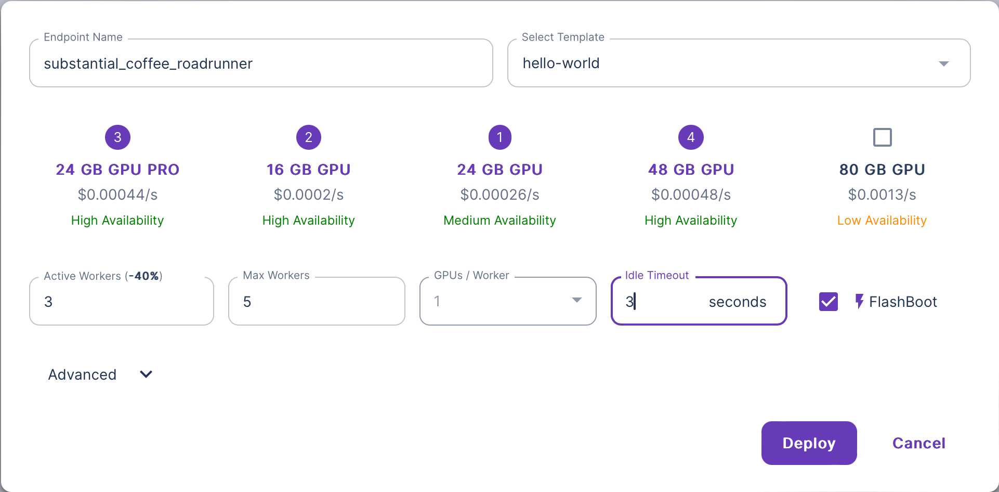

To convert a serverless template into an endpoint, navigate to [Serverless Endpoints](https://www.runpod.io/console/serverless/user/endpoints) and press `New Endpoint` to open up the endpoint creation dialog. After you are done configuring your endpoint, press `deploy`.

## Create an Endpoint

You can create an Endpoint in the Web interface.

1. Navigate to [Serverless Endpoints](https://www.dev.runpod.io/console/serverless).
2. Select **+ New Endpoint** and enter the following:
   1. Endpoint Name.
   2. Select your GPUs.
   3. Configure your workers.
   4. Select a Template.
   5. Add a container image.
   6. Select **Deploy**.

## Delete an Endpoint

You can delete an Endpoint in the Web interface.
Before an Endpoint can be deleted, all workers must be removed.

1. Navigate to [Serverless Endpoints](https://www.dev.runpod.io/console/serverless).
2. Select the Endpoint you'd like to remove.
3. Select **Edit Endpoint** and set **Max Workers** to `0`.
4. Choose **Update** and then **Delete Endpoint**.

## Edit an Endpoint

You can edit a running Endpoint in the Web interface after you've deployed it.

1. Navigate to [Serverless Endpoints](https://www.dev.runpod.io/console/serverless).
2. Select the Endpoint you'd like to edit.
3. Select **Edit Endpoint** and make your changes.
4. Choose **Update**.

:::note

You can force a configuration update by setting **Max Workers** to 0, selecting **Update**, then updating your max workers back to your needed value.

:::
